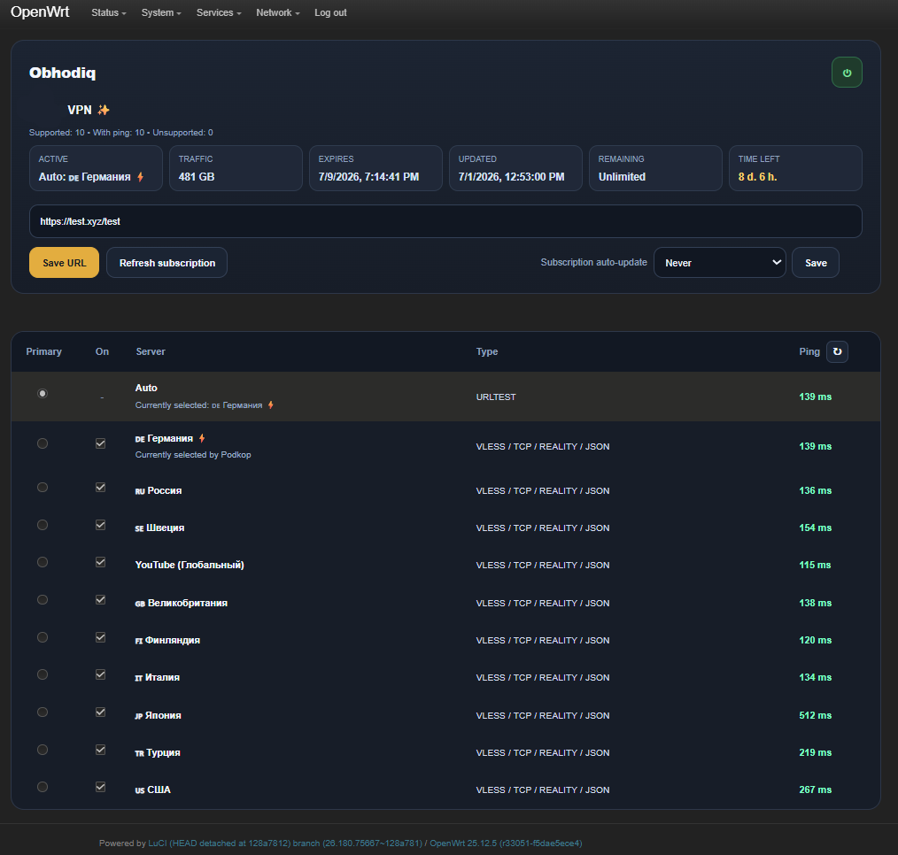

# Obhodiq

[Русский](README.md) | [English](README.en.md)

Obhodiq is an add-on for [Podkop](https://github.com/itdoginfo/podkop) on OpenWrt. It is designed for VPN subscription links: Obhodiq takes a subscription URL, parses it, builds a server list, and passes the result to Podkop. Podkop then handles routing, `URLTest`, manual switching, and latency checks.

<p align="center">
  
</p>

> [!IMPORTANT]
> Obhodiq does **not** replace Podkop. It works **only together with** the original Podkop and requires Podkop to be installed first.

> [!WARNING]
> Obhodiq is currently in **beta**. It is already usable, but different providers, subscription styles, and individual servers may behave differently.

## What Obhodiq does

- accepts VPN subscription links
- parses plain, base64, and many JSON-based subscriptions
- extracts servers from subscriptions and exports them to Podkop
- keeps `URLTest` available for automatic best-server selection
- allows manual server selection
- allows per-server enable/disable
- shows subscription info, active server, and ping returned by Podkop
- supports manual and scheduled subscription refresh

## How it works

1. Add a subscription URL.
2. Obhodiq downloads the subscription and parses supported links inside it.
3. Supported servers are prepared and exported to Podkop.
4. Podkop then handles routing, `URLTest`, manual switching, and latency.

## Supported subscription formats

Obhodiq is aimed at the kinds of subscriptions commonly used by VPN providers today: mainly V2Ray / Xray / sing-box style subscriptions and some provider-side wrapper formats.

The parser currently handles:

- plain link lists
- base64-wrapped subscriptions
- many JSON-based subscription payloads
- HAPP-style wrappers such as `happ://add/https://...`

Link families currently parsed:

- `vless://`
- `vmess://`
- `trojan://`
- `ss://`
- `socks4://`
- `socks5://`
- `hy2://`
- `hysteria://`
- `hysteria2://`

## Compatibility

Obhodiq is responsible for parsing the subscription and preparing the server list. After that, Podkop decides what it can actually apply, ping, and use successfully.

Currently hard-filtered before export:

- `XHTTP`

Additional notes:

- `happ://add/https://...` is treated as a wrapper format, not as a proxy type
- encrypted `happ://crypt4/...` subscriptions are not claimed as fully supported
- `WS`, `GRPC`, `Hysteria`, and similar formats may parse correctly, but actual behavior still depends on Podkop, `sing-box`, and the provider
- Podkop uses `sing-box`, so support for `VLESS`, `WS`, `Reality`, and other transport-dependent formats depends on `sing-box` capabilities
- for more complex cases, Podkop also supports manual configuration through `Outbound Config`

Useful references:

- [Podkop Sections](https://podkop.net/docs/sections/#tip-podklyucheniya-connection-type)
- [Custom Outbound in Podkop](https://podkop.net/docs/own-outbound/#amnezia-vless)

## Requirements

- OpenWrt
- original [Podkop](https://github.com/itdoginfo/podkop) already installed
- recommended Podkop versions: `0.7.19`, `0.7.20`
- recommended OpenWrt versions: `24.10.6`, `25.12.5`

## Install

Install the original Podkop first:

```sh
sh <(wget -O - https://raw.githubusercontent.com/itdoginfo/podkop/refs/heads/main/install.sh)
```

Then install Obhodiq:

```sh
sh <(wget -O - https://raw.githubusercontent.com/renqismike/obhodiq/main/install.sh)
```

## Manual install

If you prefer manual installation, use the package files from the release assets or from the repository `dist/` directory.

For OpenWrt with `opkg`:

```sh
opkg install obhodiq_0.1.0-r2_all.ipk luci-app-obhodiq_0.1.0-r2_all.ipk
```

For OpenWrt with `apk`:

```sh
apk add --allow-untrusted obhodiq-0.1.0-r2.apk luci-app-obhodiq-0.1.0-r2.apk
```

## Remove

Full removal:

```sh
sh uninstall.sh
```

Or manually with `opkg`:

```sh
opkg remove luci-app-obhodiq
opkg remove obhodiq
```

Or manually with `apk`:

```sh
apk del luci-app-obhodiq
apk del obhodiq
```

`uninstall.sh` also removes the saved subscription URL. Obhodiq is intended to be removable without removing or breaking Podkop itself.

## Interface

Main actions:

- `Save URL` stores the subscription URL
- `Refresh subscription` downloads and rebuilds the current subscription
- `Subscription auto-update` sets the refresh schedule
- the power button enables or disables Obhodiq integration

Server list:

- `Auto` keeps Podkop in `URLTest` mode
- the radio button switches between auto mode and a manual server
- the checkbox enables or excludes a server from export
- `Ping` shows the value returned by Podkop

## Important behavior

- if a server appears in the list, it means Obhodiq managed to parse it
- if a server has ping, it means Podkop returned latency for it
- if a server has no ping, it does not always mean the link is broken, but it does mean that in Podkop this server did not return usable latency

## Testing status

This is still a beta release and has only been checked against a limited set of subscriptions from different VPN providers, not against every possible provider or subscription style on the market.

Tested during development on:

- OpenWrt `24.10.6` with `opkg`
- OpenWrt `25.12.5` with `apk`
- Podkop `0.7.19-r1`
- Podkop `0.7.20-r1`
