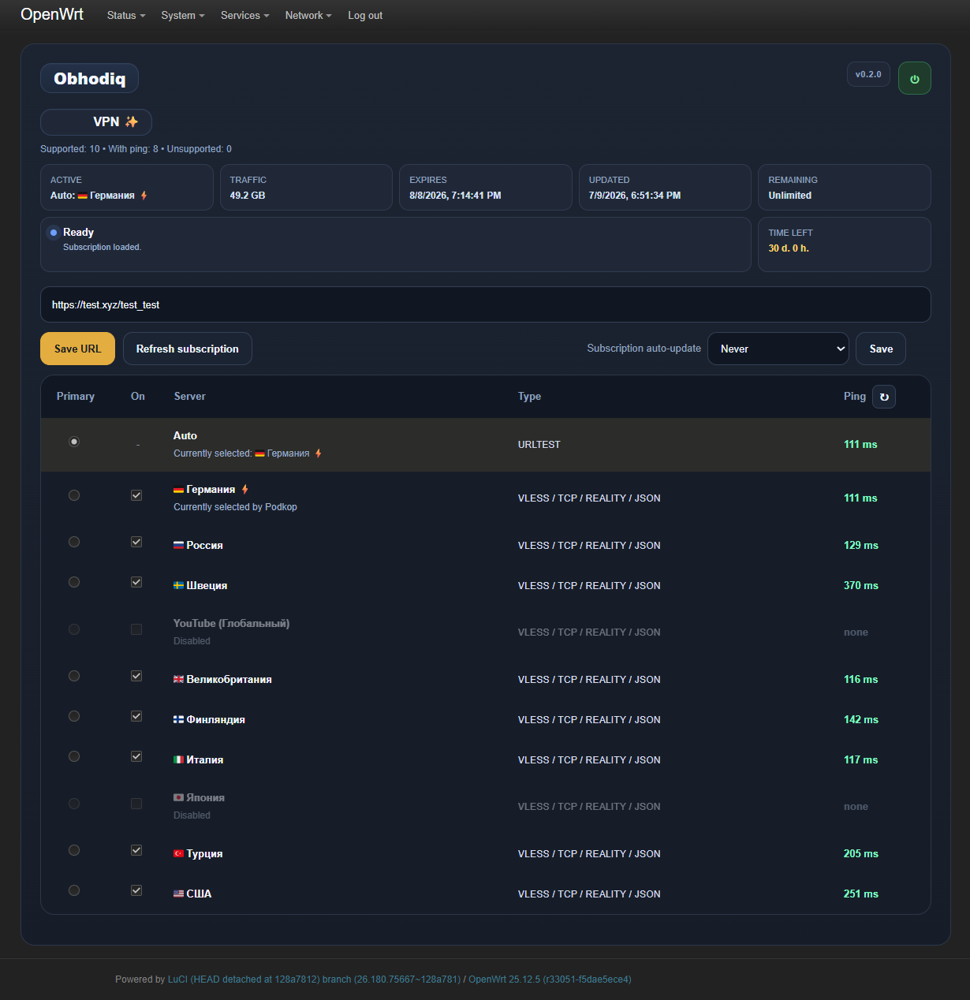

# Obhodiq

> VPN subscription parser and manager for Podkop on OpenWrt

[Русский](README.md) | [English](README.en.md)

Obhodiq — это дополнение для [Podkop](https://github.com/itdoginfo/podkop) на OpenWrt. Оно нужно для работы с VPN-подписками: Obhodiq забирает ссылку подписки, разбирает её, собирает из неё список серверов и передаёт результат в Podkop, а Podkop уже занимается маршрутизацией, `URLTest`, ручным выбором и проверкой задержки.

## Оглавление

- [Демо-проверка](#демо-проверка)
- [Важно](#важно)
- [Что умеет Obhodiq](#что-умеет-obhodiq)
- [Как это работает](#как-это-работает)
- [Форматы, которые умеет читать парсер](#форматы-которые-умеет-читать-парсер)
- [Что это значит на практике](#что-это-значит-на-практике)
- [Требования](#требования)
- [Важно по времени работы](#важно-по-времени-работы)
- [Установка](#установка)
- [Ручная установка](#ручная-установка)
- [Смена языка вручную](#смена-языка-вручную)
- [Удаление](#удаление)
- [Интерфейс](#интерфейс)
- [Как работает автообновление](#как-работает-автообновление)
- [Что важно понимать](#что-важно-понимать)
- [Если подписка не заработала](#если-подписка-не-заработала)
- [Проверка и статус](#проверка-и-статус)
- [Поддержать](#поддержать)

## Демо-проверка

Проверить, как Obhodiq разбирает подписку, можно на отдельной странице:

**[renqismike.github.io/obhodiq](https://renqismike.github.io/obhodiq/)**

Что важно:

- данные подписки остаются только в кэше браузера
- в демо используется локальный `device id`, который сохраняется в браузере и повторно используется при следующих запросах
- это уменьшает вероятность того, что провайдер будет считать каждую повторную проверку новым устройством
- разные VPN-провайдеры могут учитывать такие обращения по-разному

## Важно

> [!IMPORTANT]
> Obhodiq **не заменяет** Podkop. Он работает **только вместе** с оригинальным Podkop и требует, чтобы Podkop был установлен заранее.

> [!IMPORTANT]
> Дисклеймер. Obhodiq **не является средством обхода блокировок, VPN-сервисом или самостоятельным VPN-клиентом**. Автор проекта выступает против использования программы для нарушения действующих законов любой страны.
>
> Проект предназначен для **технической обработки подписок и управления конфигурацией Podkop на OpenWrt**: Obhodiq забирает ссылку подписки, разбирает её и подготавливает конфигурационные данные для уже установленного Podkop. Фактическое подключение, `URLTest`, маршрутизация, transport-логика и обработка трафика выполняются уже самим Podkop и его зависимостями.

> [!WARNING]
> Сейчас Obhodiq находится в **бета-статусе**. Он уже пригоден для использования, но разные провайдеры, типы подписок и отдельные серверы могут вести себя по-разному.

> [!NOTE]
> Сам Obhodiq:
> - **не содержит собственного VPN/proxy-движка**
> - **не поднимает туннели**
> - **не выполняет маршрутизацию трафика самостоятельно**
> - **не выступает провайдером VPN или прокси**
> - **не предоставляет доступ к каким-либо ресурсам сам по себе**
>
> Всё, что связано с фактическим соединением и передачей трафика, выполняется уже самим Podkop и его зависимостями.

## Что умеет Obhodiq

- принимать VPN-подписки по ссылке
- разбирать обычные, base64- и многие JSON-подписки
- вытаскивать из подписки серверы и передавать их в Podkop
- оставлять `URLTest` для автоматического выбора лучшего сервера
- давать ручной выбор сервера
- включать и выключать отдельные серверы
- импортировать `WS`-серверы **выключенными по умолчанию**, но оставлять возможность включить их вручную
- показывать информацию о подписке, текущем сервере и пинге от Podkop
- обновлять подписку вручную и по расписанию

## Как это работает

1. Добавляешь ссылку подписки.
2. Obhodiq скачивает подписку и разбирает поддерживаемые ссылки внутри неё.
3. Поддерживаемые серверы подготавливаются и экспортируются в Podkop.
4. Дальше Podkop уже сам работает с маршрутизацией, `URLTest`, ручным выбором и пингом.

## Форматы, которые умеет читать парсер

Obhodiq рассчитан на подписки, которые сейчас чаще всего выдают VPN-провайдеры: V2Ray / Xray / sing-box подписки и некоторые провайдерские обёртки вокруг них.

Сейчас парсер умеет работать с:

- обычными списками ссылок
- base64-подписками
- многими JSON-подписками
- HAPP-обёртками вида `happ://add/https://...`

Для части провайдерских обёрток в Obhodiq также используется эмуляция клиента `HApp 1.0`, чтобы некоторые точки выдачи подписок вообще начали отдавать ожидаемый ответ.

Семейства ссылок, которые сейчас умеет распознавать и разбирать парсер:

- `vless://`
- `vmess://`
- `trojan://`
- `ss://`
- `socks4://`
- `socks5://`
- `hy2://`
- `hysteria://`
- `hysteria2://`

## Что это значит на практике

> [!IMPORTANT]
> `WS`-серверы в Obhodiq сейчас **добавляются выключенными по умолчанию**. В наших проверках они часто работали нестабильно, но разработчиками Podkop / sing-box заявлена возможная поддержка `WS`, поэтому при желании их можно включить вручную и проверить отдельно.

Важно разделять две вещи:

1. Obhodiq смог распарсить ссылку и добавить сервер в список.
2. Podkop смог реально применить этот сервер, пропинговать его и использовать.

Obhodiq отвечает только за первую часть. Дальше уже сам Podkop решает, что он реально может применить, пропинговать и использовать.

Что сейчас жёстко отсекается до экспорта:

- `XHTTP`

Дополнительно:

- `happ://add/https://...` считается форматом-обёрткой, а не отдельным типом прокси
- шифрованные `happ://crypt4/...` не заявляются как полностью поддержанные
- `WS`, `GRPC`, `Hysteria` и похожие форматы могут нормально распарситься, но их фактическая работа уже зависит от Podkop, `sing-box` и конкретного провайдера
- `WS` сейчас добавляется в список **выключенным по умолчанию**, потому что в наших проверках такие серверы часто не работали стабильно; при этом разработчиками Podkop/sing-box заявлена возможная поддержка `WS`, поэтому такой сервер можно включить вручную и проверить отдельно
- Podkop использует `sing-box`, поэтому поддержка `VLESS`, `WS`, `Reality` и других вариантов, зависящих от транспорта соединения, определяется возможностями `sing-box`
- для сложных случаев Podkop также допускает ручную настройку через `Outbound Config`

По текущим проверкам:

- лучше всего у нас проверены обычные `VLESS`-подписки, которые Podkop нормально использует в `URLTest`
- `Trojan`, `Shadowsocks`, `Socks`, `Hysteria2`, `VMess` и другие семейства ссылок парсер умеет читать, но это не означает, что любая такая ссылка гарантированно отработает в Podkop у любого провайдера
- если у сервера нет пинга, это значит не то, что ссылка обязательно битая, а то, что именно Podkop не вернул по нему нормальный пинг в текущей конфигурации

Полезные ссылки по этому поводу:

- [Секции Podkop](https://podkop.net/docs/sections/#tip-podklyucheniya-connection-type)
- [Свой Outbound в Podkop](https://podkop.net/docs/own-outbound/#amnezia-vless)

## Требования

- OpenWrt
- уже установленный оригинальный [Podkop](https://github.com/itdoginfo/podkop)
- рекомендуемые версии Podkop: `0.7.19`, `0.7.20`
- рекомендуемые версии OpenWrt: `24.10.6`, `25.12.5`

## Важно по времени работы

> [!IMPORTANT]
> Парсинг подписки, применение изменений, обновление пинга и включение или выключение серверов **могут занимать некоторое время**.
>
> Скорость этих операций зависит от:
> - мощности роутера
> - числа серверов в подписке
> - того, как быстро сам Podkop возвращает данные
>
> Если ты нажал обновление, переключение или отключение сервера, **нужно дождаться завершения операции** и не прожимать много действий подряд.

## Установка

Сначала установи оригинальный Podkop:

```sh
sh <(wget -O - https://raw.githubusercontent.com/itdoginfo/podkop/refs/heads/main/install.sh)
```

Потом установи Obhodiq:

```sh
sh <(wget -O - https://renqismike.github.io/obhodiq/install.sh)
```

Если у провайдера плохо открывается GitHub Pages, запасной вариант:

```sh
sh <(wget -O - https://github.com/renqismike/obhodiq/raw/main/install.sh)
```

## Ручная установка

Если нужна ручная установка, используй файлы пакетов из release assets.

Для OpenWrt с `opkg`:

```sh
opkg install obhodiq_0.2.0_all.ipk luci-app-obhodiq_0.2.0_all.ipk
```

Для OpenWrt с `apk`:

```sh
apk add --allow-untrusted obhodiq-0.2.0.apk luci-app-obhodiq-0.2.0.apk
```

### Смена языка вручную

Команды ниже одинаково подходят для Obhodiq, установленного как через `opkg` (`ipk`), так и через `apk`.

```sh
/usr/bin/obhodiq set-lang ru
/usr/bin/obhodiq set-lang en
```

## Удаление

Рекомендуемое полное удаление:

```sh
sh <(wget -O - https://renqismike.github.io/obhodiq/uninstall.sh)
```

Запасной вариант:

```sh
sh <(wget -O - https://github.com/renqismike/obhodiq/raw/main/uninstall.sh)
```

Ручное удаление пакетов через `opkg`:

```sh
opkg remove luci-app-obhodiq
opkg remove obhodiq
```

Ручное удаление пакетов через `apk`:

```sh
apk del luci-app-obhodiq
apk del obhodiq
```

Важно:

- вариант через `uninstall.sh` — основной и рекомендуемый, потому что он использует официальный файл удаления из репозитория
- ручное удаление через `opkg` или `apk` тоже должно корректно вычищать хвосты Obhodiq, если установлена актуальная версия пакета
- удаление Obhodiq не должно удалять и ломать сам Podkop

## Интерфейс



Основные действия:

- `Сохранить ссылку` — сохраняет ссылку подписки
- `Обновить подписку` — заново скачивает и пересобирает текущую подписку
- `Автообновление подписки` — задаёт расписание автообновления
- кнопка питания — включает или отключает интеграцию Obhodiq

Список серверов:

- `Авто` оставляет Podkop в режиме `URLTest`
- радиокнопка переключает между авто-режимом и ручным сервером
- галочка включает или исключает сервер из экспорта
- `Пинг` показывает значение, которое вернул Podkop

### Как работает автообновление

Автообновление работает по расписанию cron, а не от момента, когда ты выбрал значение в списке.

Текущее расписание такое:

- `30 минут` — в `00` и `30` минут каждого часа
- `1 час` — в начале каждого часа
- `3 часа` — в `00:00`, `03:00`, `06:00`, `09:00`, `12:00`, `15:00`, `18:00`, `21:00`
- `6 часов` — в `00:00`, `06:00`, `12:00`, `18:00`
- `12 часов` — в `00:00` и `12:00`
- `24 часа` — каждый день в `03:00`
- `Никогда` — автообновление отключено

Если Obhodiq выключен кнопкой питания, автообновление тоже не выполняется.

## Что важно понимать

- если сервер попал в список, это значит, что Obhodiq смог его распарсить
- если у сервера есть пинг, это значит, что Podkop смог вернуть по нему нормальный пинг
- если пинга нет, это не всегда означает, что ссылка битая, но это значит, что именно в Podkop такой сервер сейчас не дал нормальный пинг
- наличие семейства ссылки в этом README означает поддержку разбора в Obhodiq, а не безусловную гарантию работы каждого сервера у любого провайдера
- сам факт наличия поддержки формата в Obhodiq **не гарантирует**, что конкретная подписка конкретного провайдера распарсится без проблем

## Если подписка не заработала

- не каждая провайдерская подписка будет совпадать с теми форматами, которые уже проверялись в Obhodiq
- если твоя ссылка не распарсилась или серверы повели себя странно, открой issue в репозитории
- по возможности приложи обезличенный пример ответа или описание формата без личных токенов, UUID, доменов и приватных URL
- если это новый рабочий формат, я постараюсь отдельно его проверить и при возможности добавить поддержку

## Проверка и статус

Это всё ещё бета-версия, и она проверялась только на ограниченном наборе подписок от разных VPN-провайдеров, а не на всех возможных вариантах на рынке.

Во время разработки приложение проверялось на:

- OpenWrt `24.10.6` с `opkg`
- OpenWrt `25.12.5` с `apk`
- Podkop `0.7.19-r1`
- Podkop `0.7.20-r1`

## Поддержать

Если Obhodiq оказался вам полезен и вы хотите поддержать развитие проекта, можно воспользоваться любым удобным способом ниже.

**[Донат через CloudTips](https://pay.cloudtips.ru/p/13b7f0a4)**

<table>
  <tr>
    <td align="center" width="33%">
      
    </td>
    <td align="center" width="33%">
      
    </td>
    <td align="center" width="33%">
      
    </td>
  </tr>
  <tr>
    <td align="center"><strong>USDT (TRC20 / Tron)</strong></td>
    <td align="center"><strong>USDT (BEP20 / BNB Smart Chain)</strong></td>
    <td align="center"><strong>Binance Pay</strong></td>
  </tr>
  <tr>
    <td align="center"><code>TYmyHohGWZWGrfb7fKHhCNDX6cvC81jMrU</code></td>
    <td align="center"><code>0x038feAFa22c8FDC8dB98CAd1943a64545B42CB0d</code></td>
    <td align="center"><code>Binance Pay</code></td>
  </tr>
</table>

Спасибо за поддержку проекта.

